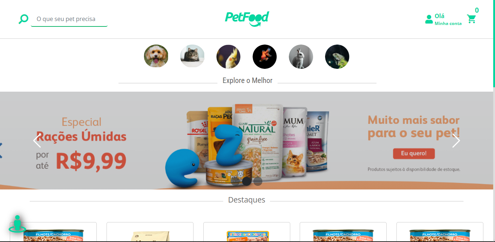
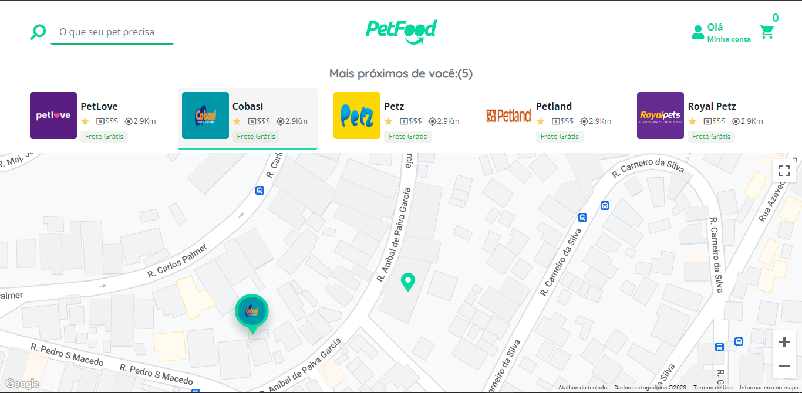
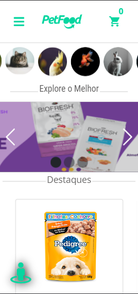
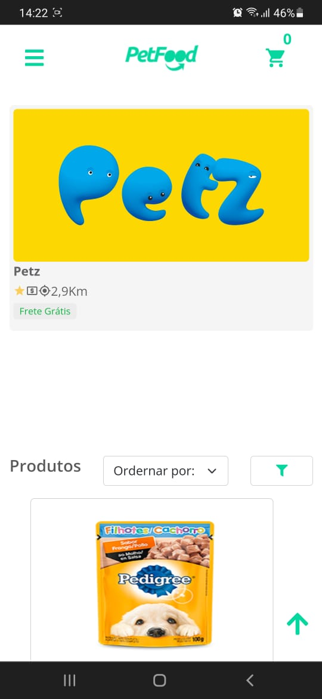
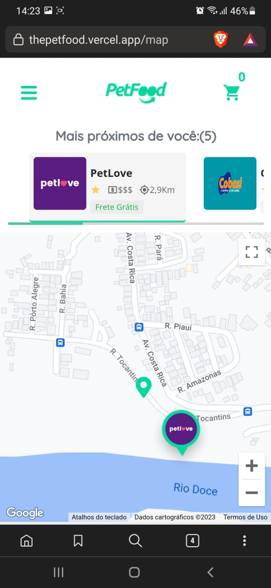

## LICENSE!

[](https://github.com/ManoelPatrocinio/Petfoof_fontend/edit/mainLICENSE)

## 💻 Sobre o projeto

Este projeto é um marketplace para petshops, onde o cliente poderá encontrar as petshops mais próximas, visualizando-as através do mapa, e, finalizando a compra no próprio site, visto que há integração com a api do Pagar.me.

[Confira o projeto](https://thepetfood.vercel.app/)

## TECNOLOGIAS USADAS

- ReactJS
- Styled Components
- Redux
- Redux Saga
- React Hook Form
- Sweetalert

## Proxímas Imprementações

- Aplicação de técnicas UX/UI
- Otimização e SEO

## 🎨 Layout

</br>
O layout da aplicação está disponível no Figma:

<a href="https://www.figma.com/file/Js7in6EaEfs0BjF9xBnrr4/MyPetfood?node-id=0%3A1&t=KtOtzrRS9SXqNzd0-1">
  
</a>

### Web

<p align="center" style="display: flex; align-items: flex-start; justify-content: space-between;">


</p>

### Mobile

<div align="center"  style="width:100%; display: flex; align-items: flex-start; justify-content: space-between;">
 
 
 
</div>

### Pré-requisitos

Antes de começar, você vai precisar ter instalado em sua máquina as seguintes ferramentas:
[Git](https://git-scm.com), e, Além disto, é bom ter um editor para trabalhar com o código como [VSCode](https://code.visualstudio.com/)

### 🎲 Rodando o Projeto

```bash
# Clone este repositório
$ git clone <https://github.com/ManoelPatrocinio/Petfoof_fontend>

# Acesse a pasta do projeto no terminal/cmd
$ cd Petfoof_fontend

# Instale as dependências iniciais
$ npm install
$ npm install --global yarn
$ yarn init -Y

# Execute a aplicação
$ yarn start

# O servidor inciará na porta:3000 - acesse <http://localhost:3000>


```

### Autor

Feito por Manoel Patrocinio 👋🏽 Entre em contato!

[](https://www.instagram.com/patrocinioiii/) [](https://linkedin.com/in/manoel-patrocinio-1b342b203)
[](mailto:manoelpatrocinio99@gmail.com)
